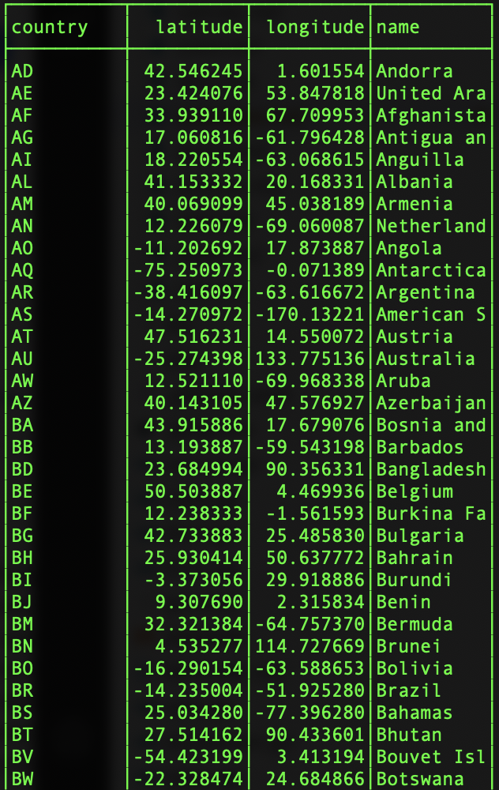
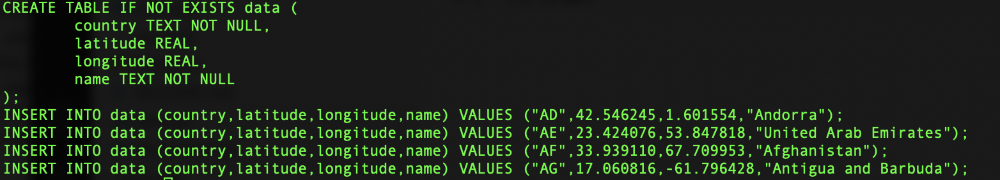

# Examples

There are a number of example applications in the `cmd` folder which demonstrate features of the code. In order to build the examples, you'll need a working go compiler. There is a makefile in the repository which can be used to compile the examples:

```bash
bash% git clone git@github.com:djthorpe/data.git
bash% cd data
bash% make
bash% cd build/cmd && ls
```

A temporary `build` folder is created for intermediate and binary data. You can remove the build folder and any other intermediate data using the `make clean` command.

## Extraction of CSV data

The `csvreader` command can be used to extract CSV data and transform to ASCII, CSV, SQL or XML format:

```go
bash% export URL=https://raw.githubusercontent.com/google/dspl/master/samples/google/canonical/countries.csv
bash% ./csvreader (-xml|-sql|-csv) ${URL}
```

These screenshots demonstrate ASCII and SQL output:





## Color Swatches and SVG output

The `colorswatch` command demonstrates:

  * Enumerating a swatch into a palette of colors;
  * Generating an SVG canvas and writing to stdout;
  * Using color distance to set an appropriate foreground colour.

For example, the following command produces a palette of red, blue and green colours:

```go
bash% ./colorswatch red blue green > swatch.svg
bash% open swatch.svg
```

## Constructing SVG from instructions

The `tiger` command takes a set of input instructions and generates an SVG file.

